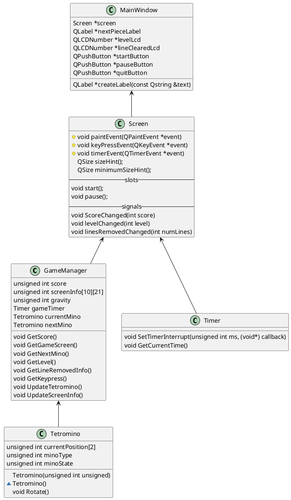
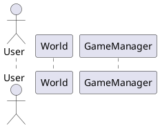
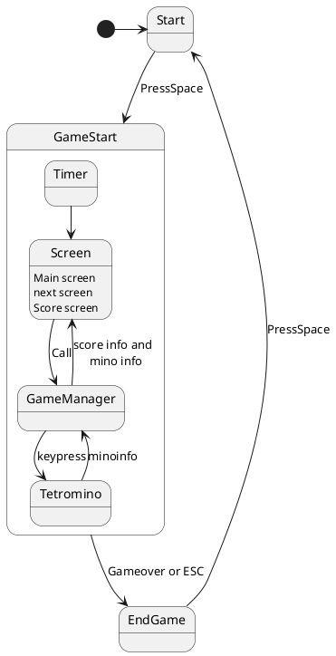

# Software Design Specification

## Revision History
| Date | Name  | Description |
|------| ----- | ----------- |
|20181021|신종환| 첫 작성|

## 1. Introduction
### 1.1 Purpose
이 문서의 목적은 테트리스 게임의 설계를 정의 하는 것이다.
이 문서는 예상되는 입력, 클래스, 그리고 함수에 대한 설명을 한다. 요구사항 Matrix는 문서의 끝에 적혀있다. 
### 1.2 Scope
테트리스 게임을 구현하기 위한 설계에 대한 정의
### 1.3 Objective
이 소프트웨어는 고전 게임인 테트리스 게임의 Qt와 Modern C++를 활용한 구현이다. 게임은 일시정지할 수 있으며, 게임 오버 이후에는 점수를 데이터베이스에 저장한다.

## 2. System Overview
### 2.1 Product Perspective

#### 2.1.1 Design Method
이 소프트웨어의 설계는 객체 지향 설계를 활용한다.

#### 2.1.2 User Interfaces
이 소프트웨어의 유저 인터페이스는 스크린과 키 입력이 있다.

#### 2.1.3 Hardware Interfaces
대부분의 PC 플랫폼은 이 소프트웨어를 구동할 수 있다.

#### 2.1.4 Software Interfaces

#### 2.1.5 Memory Constraints
#### 2.1.6 Operations
#### 2.1.7 Site Adaption Requirements

### 2.2 Product Functions
### 2.3 User Characteristics
### 2.4 Constraints
### 2.5 Assumptions and Dependencies
### 2.6 Apportioning of Requirements

## 3. Design Considerations
### 3.1 Operating Environment
### 3.2 Fault Torlerant Design
### 3.3 Design Convensions
### 3.4 Architectural Design
### 3.5 User Interface

## 4. System Architecture
### 4.1 View of Product Classes (Figure 1)

### 4.2 Individual Classes of System

## 5. Figures
### 5.1 Use Cases(Figure 2)

### 5.2 StateDiagram

## 6. References
## Tetris Software 

## hello
